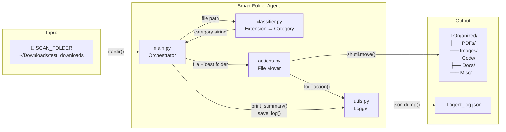

# Smart Folder Agent

A minimal local Python agent that watches a folder, classifies every file by extension, moves it into the right category subfolder, and writes a JSON log — no external dependencies, no config files.

---

## Architecture



---

## Supported categories

| Category   | Extensions                                      |
|------------|------------------------------------------------|
| PDFs       | `.pdf`                                         |
| Docs       | `.doc` `.docx`                                 |
| Text       | `.txt` `.md`                                   |
| Images     | `.jpg` `.jpeg` `.png` `.gif` `.webp`           |
| Videos     | `.mp4` `.mov`                                  |
| Audio      | `.mp3` `.wav`                                  |
| Archives   | `.zip` `.tar` `.gz`                            |
| Data       | `.csv` `.json` `.xlsx`                         |
| Code       | `.py` `.js` `.html`                            |
| Misc       | everything else                                |

---

## Usage

```bash
python3 main.py
```

Files are read from:

```
~/Downloads/test_downloads/
```

Organized output lands in:

```
~/Downloads/test_downloads/Organized/<Category>/
```

A log of every action is written to:

```
~/Downloads/test_downloads/Organized/agent_log.json
```

---

## Configuration

| What to change       | Where                                  |
|----------------------|----------------------------------------|
| Source folder        | `SCAN_FOLDER` in `main.py`             |
| Output folder        | `OUTPUT_FOLDER` in `main.py`           |
| Extension → category | `EXTENSION_MAP` in `classifier.py`     |

---

## Project structure

```
localagent/
├── main.py          # Entry point — scans folder, drives the loop
├── classifier.py    # Maps file extension to category string
├── actions.py       # Moves files; handles duplicate filenames
└── utils.py         # In-memory log, JSON save, summary printer
```

---

## License

MIT
